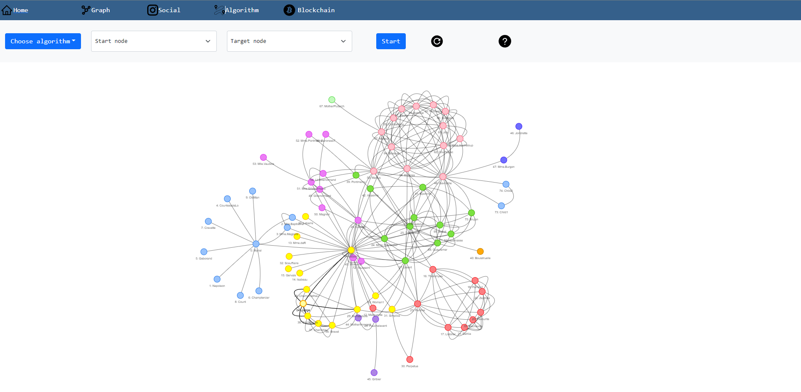
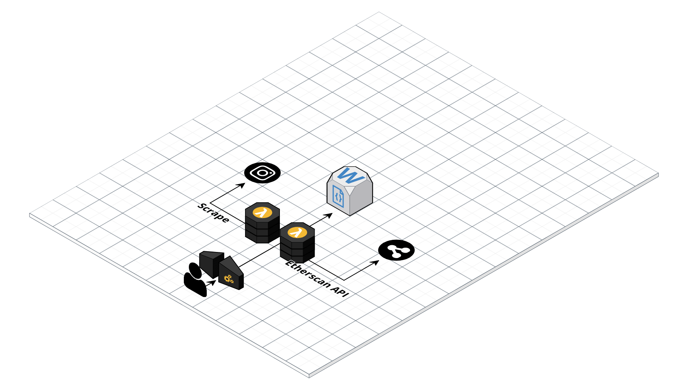

About this project
My inspiration for this project came when looking for a tool to visualize network graph data, I specifically wanted to use it to visualize the first insider trading case in crypto. I struggled to find a lightweight tool that allowed you to visualize your own data without first having to go through the process of creating a complex database with their service.

So my idea for a light weight aplication that allowed users to visualize data easily in the browser arouse.

How I built it
The first step was building the site itself, which was simple. I started building the landing page in which I have a simple explanation about these stools capabilities and features, for this simple part I simply used React with Bootstrap.

After that I moved on to building the tool itself I created a simple toolbar and the graph section itself was build using the third party package react-graph-vis (which is based on vis.js) to visualize the graph data.

I also added tabs for the diffretn types of funcionaliies such as one for starting search algorithms

Another important part of for this was building the backend built with Amazon Web Services, I used a lambda function retrieve and process blockchain data set. Since the data retrieved from the ether-scan API was much larger and complex than the sample data I provided, and therefore needed more computing power, which would slow down the site but would work well in AWS.

